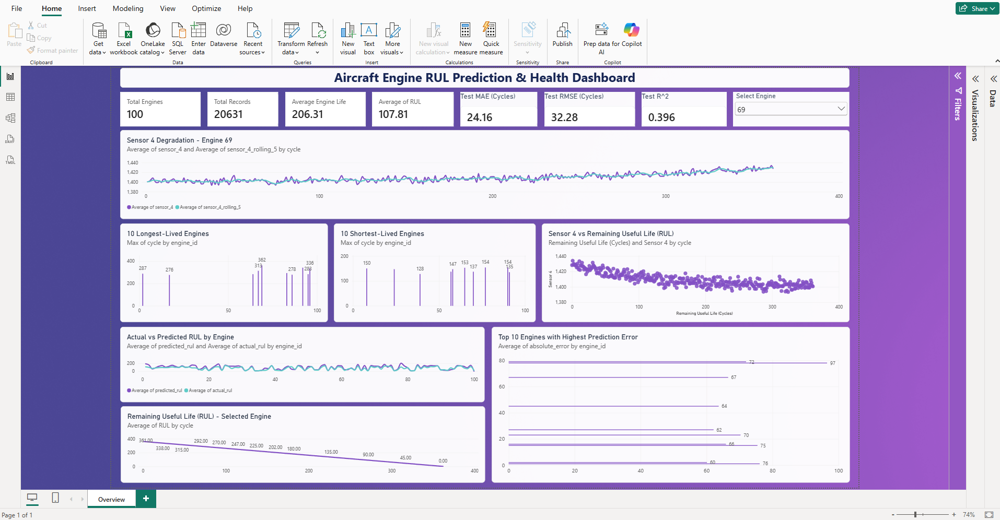

# Aircraft Engine RUL Prediction

**Predictive maintenance project using Python, Machine Learning, SQL Server, and Power BI.**

## 📌 Project Overview

Built an end-to-end machine learning pipeline to predict the **Remaining Useful Life (RUL)** of aircraft engines from historical sensor data.

The project covers:

- 📊 Data exploration and preprocessing
- ⚙️ Sensor feature engineering and rolling averages
- 🤖 Machine learning for RUL prediction
- 🗄️ SQL Server analysis using views and window functions
- 📈 Interactive Power BI dashboard for engine health and model analysis

## 📊 Dataset

- **100 aircraft engines**
- **20,631 engine-cycle records**
- **21 sensor measurements**
- Target: **Remaining Useful Life (RUL)**

## 🤖 Model Performance

| Metric | Test Result |
|---|---:|
| **MAE** | **24.16 cycles** |
| **RMSE** | **32.28 cycles** |
| **R²** | **0.396** |

The final model was evaluated on **unseen test-engine data**.

## 📈 Power BI Dashboard

The dashboard provides an interactive view of:

- Engine fleet KPIs
- Engine lifetime comparison
- Sensor degradation trends
- 5-cycle rolling-average analysis
- RUL degradation
- Actual vs. predicted RUL
- Prediction error analysis

## Power BI Dashboard

The dashboard uses **Engine 69 as an example case** to demonstrate sensor degradation and RUL trends. Engine 69 was selected because it has one of the longest operating lifetimes in the training dataset (**362 cycles**), making its degradation trend easy to visualize.

## 🛠️ Tech Stack

**Python:** Pandas, NumPy, Scikit-learn, Matplotlib  
**SQL:** SQL Server, SSMS, Views, Window Functions  
**Visualization:** Power BI  
**Development:** VS Code, GitHub

## Conclusion

Built an end-to-end aircraft engine predictive maintenance solution to analyze sensor degradation and predict Remaining Useful Life (RUL). The project integrates Python, machine learning, SQL Server analytics, and Power BI visualization to transform raw engine data into actionable insights.

**Outcome:** The final model achieved a **MAE of 24.16 cycles** and **RMSE of 32.28 cycles** on 100 unseen test engines, while the Power BI dashboard provides an interactive view of engine health, degradation trends, RUL, and prediction errors.

